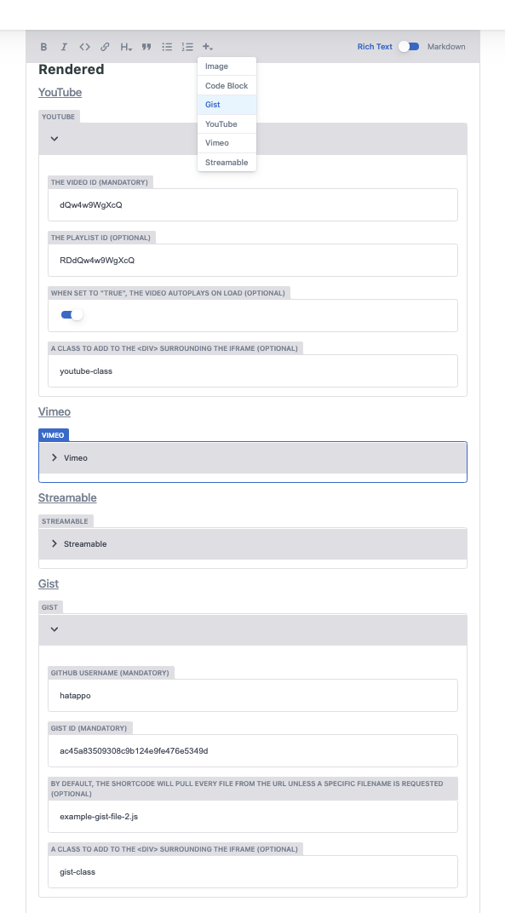
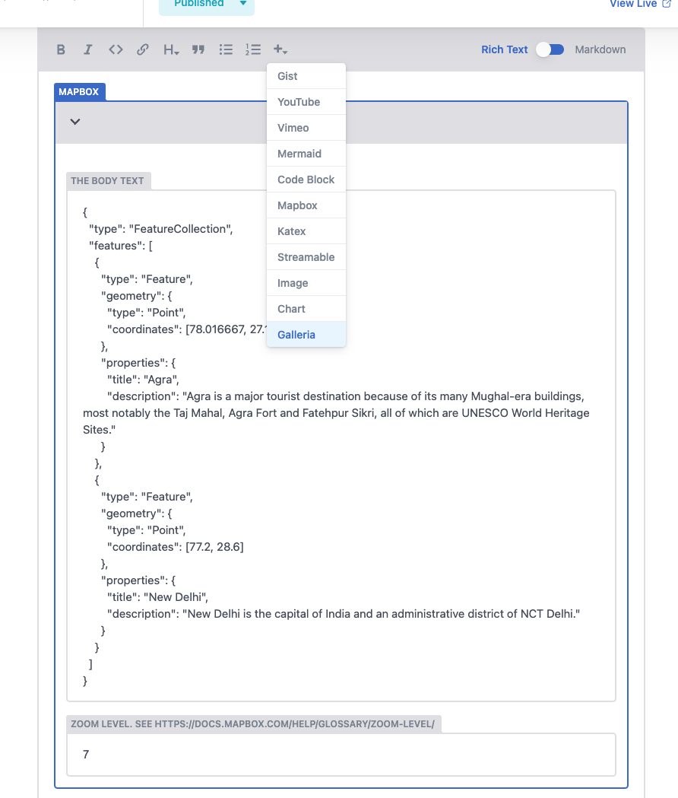
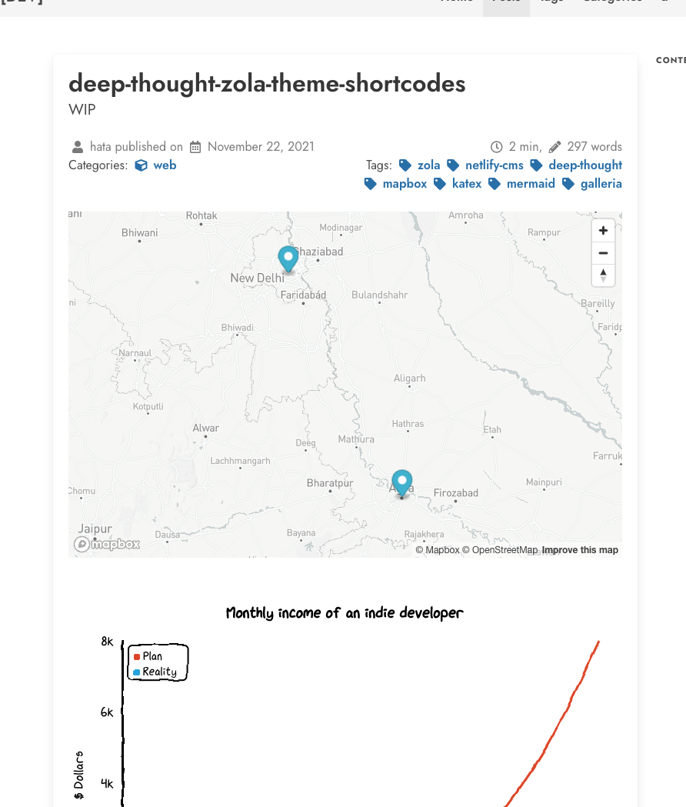
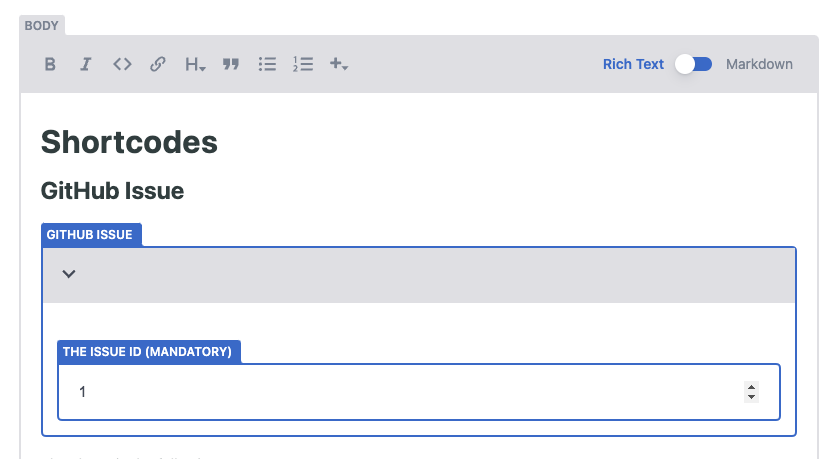
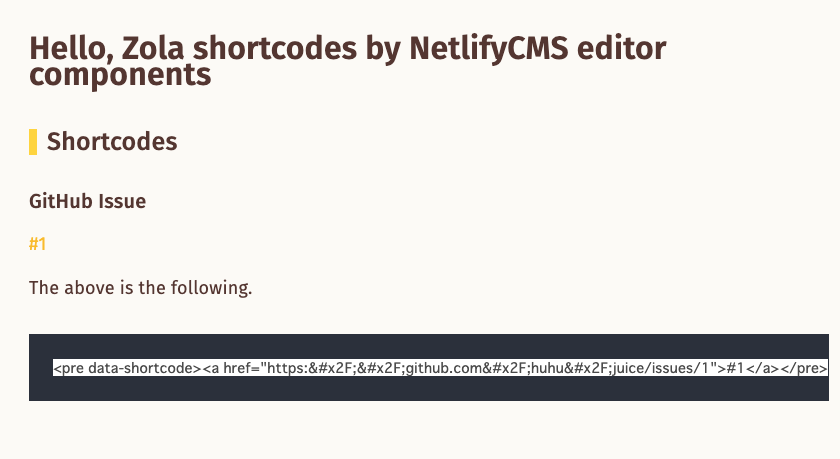
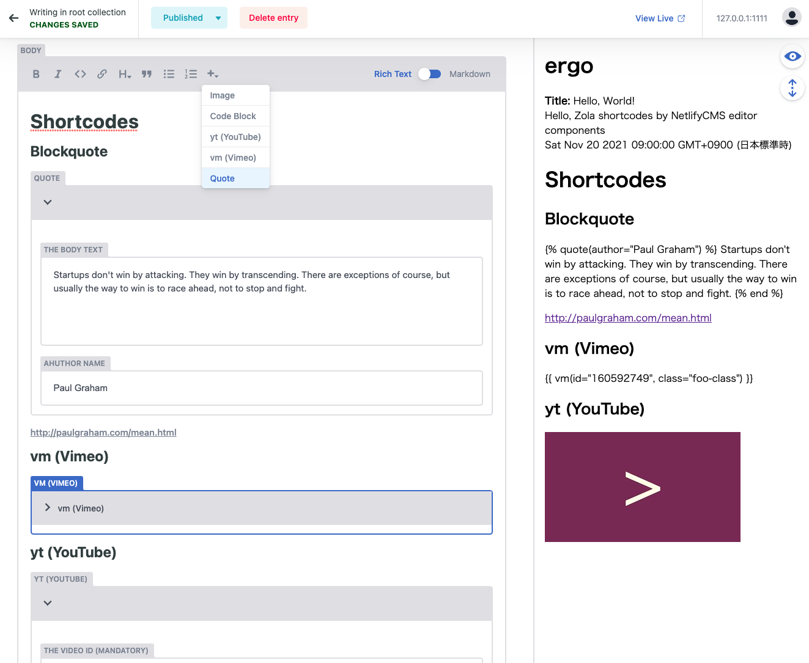
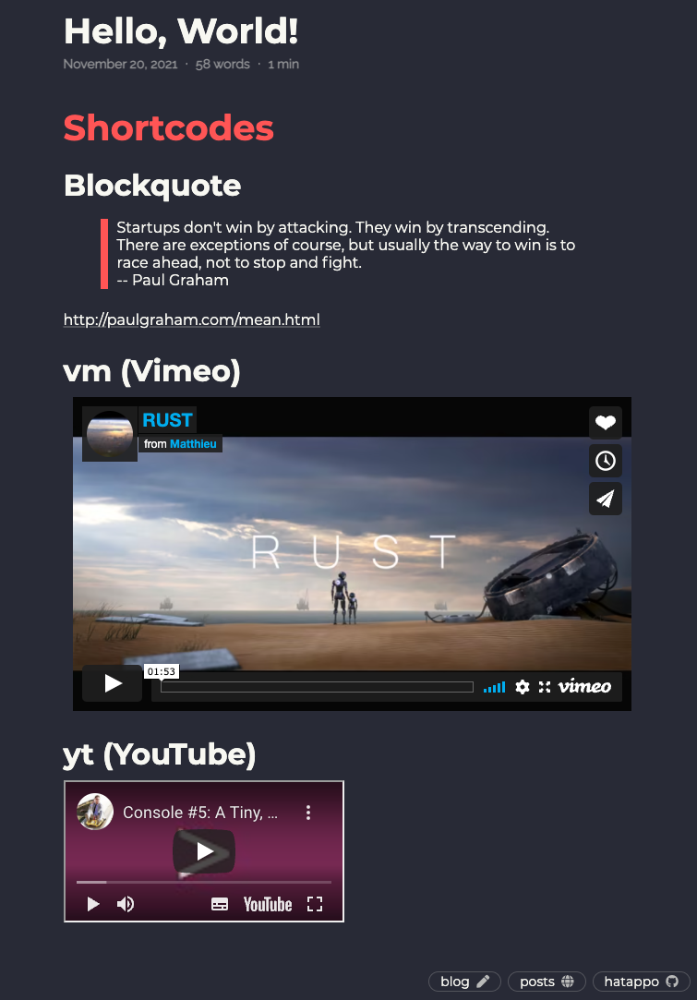

# Netlify CMS Editor Components for Zola Shortcodes


## Supported List


### [Built-in](https://www.getzola.org/documentation/content/shortcodes/#built-in-shortcodes)

1. Gist
2. Streamable
3. Vimeo
4. YouTube



### [Theme - DeepThought](https://github.com/RatanShreshtha/DeepThought)

- [Shortcodes HTML](https://github.com/RatanShreshtha/DeepThought/tree/main/templates/shortcodes)
- [Docs](https://github.com/RatanShreshtha/DeepThought/blob/main/content/docs/extended-shortcodes/index.md)

1. Chart
2. Galleria
3. Katex
4. MapBox
5. Mermaid
6. Vimeo
7. YouTube

 


### [Theme - Juice](https://github.com/huhu/juice)

- [Shortcodes HTML](https://github.com/huhu/juice/tree/master/templates/shortcodes)
- [Docs](https://github.com/huhu/juice#shortcodes)

1. GitHub Issue

 


### [Theme - Ergo](https://github.com/insipx/Ergo)

- [Shortcodes HTML](https://github.com/insipx/Ergo/tree/master/templates/shortcodes)

1. Block quote
1. Vimeo (vm.html)
1. YouTube (yt.html)

 


## Usage

1. Select the appropriate JS file for your Zola Theme in the [dist](/dist) and add it to the `static` directory in your Zola repository.
2. Then, set it to be loaded after the `netlify-cms.js` script tag.

e.g. If you put [zola-shortcodes-netlify-cms.built-in.js](/dist/zola-shortcodes-netlify-cms.built-in.js) in your `static/js` directory, you can write the following in `stacic/admin/index.html`

```html
<!DOCTYPE html>
<html>
  <head>
    <link href="/_cms/config.yml" type="text/yaml" rel="cms-config-url">
    <meta charset="utf-8" />
    <meta name="viewport" content="width=device-width, initial-scale=1.0" />
    <title>Content Manager</title>
    <script src="https://identity.netlify.com/v1/netlify-identity-widget.js"></script>
  </head>
  <body>
    <script src="https://unpkg.com/netlify-cms@^2.0.0/dist/netlify-cms.js"></script>
    <script src="/js/zola-shortcodes-netlify-cms.built-in.js"></script><!-- HERE -->
  </body>
</html>
```


## Unique Shortcodes added by each theme 

You can select the appropriate one from [dist](/dist).
It's named like `zola-shortcodes-netlify-cms.<THEME_NAME>.js`.
If you can't find a theme you use, nice to write it and PR it.


## FAQ

#### There is no appropriate Javascript file for your Theme in the `dist`

It would be great if you could write it using the `src` folder as a reference and send a PR.


#### If you use a xxxx theme, you should put and load two files like `*.built-in.js` and `*.xxxx.js` ?

No. It's OK you select only one `*.xxxx.js`. It's merged one for built-in Shortcodes, and overwritten with duplicate them.


## Reference

Netlify CMS Editor Components
- [Creating Custom Widgets | Netlify CMS | Open-Source Content Management System](https://www.netlifycms.org/docs/custom-widgets/#registereditorcomponent)
- [netlify-cms/index.js at 92d8c50272835201229d4265ef2ee18ee657dc17 · netlify/netlify-cms](https://github.com/netlify/netlify-cms/blob/92d8c50272835201229d4265ef2ee18ee657dc17/packages/netlify-cms-editor-component-image/src/index.js)

Zola Shortcodes
- [Shortcodes | Zola](https://www.getzola.org/documentation/content/shortcodes/)
- [zola/components/templates/src/builtins/shortcodes at v0.14.1 · getzola/zola](https://github.com/getzola/zola/tree/v0.14.1/components/templates/src/builtins/shortcodes)

